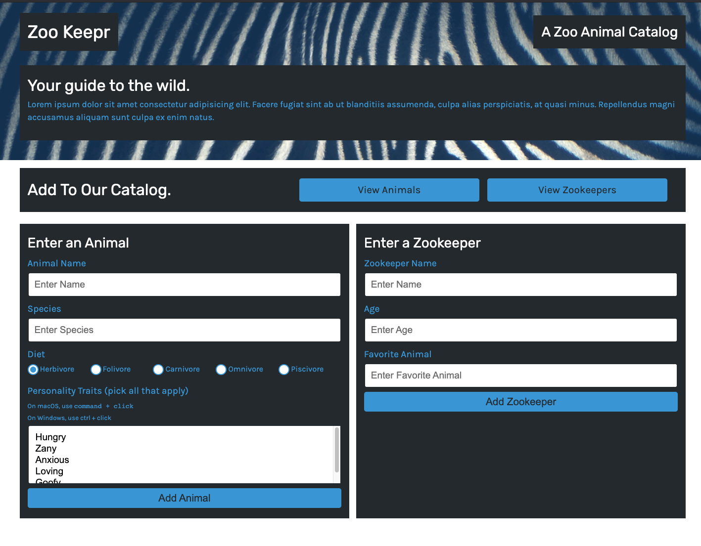

# Express-Zookeeper
Project to create a web server for a front-end application, called Zoo Keeper to store the data on an Express Server

[GitHub Repo](https://github.com/Robert-Schwartz/Express-Zookeeper)  

This site is published at: https://robert-schwartz.github.io/Express-Zookeeper/

## Description
Project to create a web server for a front-end application, called Zoo Keepr to store the data on an Express Server

## Table of Contents
- [Technologies](#Technologies)
- [Installation](#Installation)
- [Usage](#usage)
- [Contributions](#Contributions)
- [Contact](#Contact)
- [License](#license)

## Technologies
This project was built using HTML, CSS, Javascript, node.js, JEST npm, Express, insomia and heroku

## Installation
requires download of node.js, npm, and Express

## Usage
> - initiate proper npm packages by running NPM i 
> - run npm start to start express server
>  - visit localhost:3001 to view website
    >  - enter Animal or Zookeeper forms to add an animal or zookeeper 
    >  - enter View Animals or View Zookers to view stored information 
    >  - Filter your search by diet or personality traits 

## Contributions
Robert Schwartz, UofA Bootcamp lesson project 

## Contact
Contact me with any questions
- Github Profile: (https://github.com/Robert-Schwartz)
- E-mail me: bschwartz23@gmail.com

## License
none used
